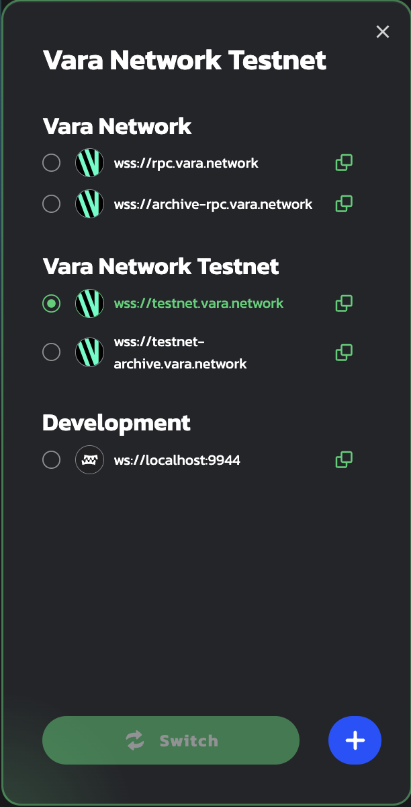

# Create an Account

1. Download the Polkadot extension for your browser via [https://polkadot.js.org/extension/](https://polkadot.js.org/extension/). This extension manages accounts and allows the signing of transactions with those accounts. It is a secure tool that allows injecting your accounts into any Substrate-based dapp. It does not perform wallet functions, e.g send funds.

2. Once downloaded, click <kbd>+</kbd> button to create a new account:

    

3. Make sure you save your 12-word mnemonic seed securely.

    

4. Select the network that will be used for this account - choose "Allow to use on any chain". Provide any name to this account and password and click "Add the account with the generated seed" to complete account registration.

    

5. Go to **[idea.gear-tech.io](https://idea.gear-tech.io)**. You will be prompted to grant access to your account for Gear Tech application, click "Yes, allow this application access".

    

6. Make sure you are connected to the `Vara Network Testnet`. The network name is on the bottom left corner of the page.

    

7. You may switch the network by clicking on the network name.

    

8.    Click the `Connect` button on the top-right to select an account that will be connected to Gear Tech.

    

9. In accordance with the Actor model, smart contracts are uploaded to a network via messages. Gear node charges a gas fee during message processing. Your account balance needs to have enough funds to upload a smart-contract to the `TestNet`. Click the following button to get the test balance:

    

    A notification about successful balance replenishment will appear after passing captcha at the bottom of the window. You can also see the current account balance next to the account name in the upper right corner.

    
