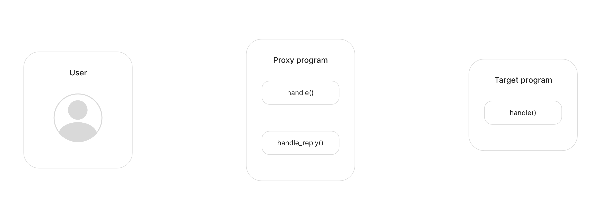

# Message receiving

In this lesson, you will learn how a program can efficiently handle request messages. This concept will be illustrated through an example of interaction between two programs. 

Before analyzing the program code in detail, it will be helpful to first present a schematic overview of how Gear programs operate:



1. The user sends an `Action` message to Program #1, which is processed by the `handle()` function.
2. This message is then passed to Program #2.
3. Program #1 sends an `Event` message to the user, indicating that the message was successfully passed to Program #2.
4. Program #2 receives the message from Program #1, processes it, and responds.
5. Program #1 receives the reply message from Program #2 via the `handle_reply()` entry point.
6. Finally, from the `handle_reply()` function, Program #1 sends the response to the user.

## First program

The primary task of the first program is to communicate with the second program, requiring the following structure:

```rust
struct Session {
    second_program: ActorId, // second program address
    msg_id_to_actor: (MessageId, ActorId), // tuple of message identifiers and message source address
}
```

The following actions and events will be necessary to simulate a dialogue between the programs:

```rust
#[derive(TypeInfo, Encode, Decode)]
#[codec(crate = gstd::codec)]
#[scale_info(crate = gstd::scale_info)]
pub enum Action {
    Hello,
    HowAreYou,
    MakeRandomNumber{
        range: u8,
    },
}

#[derive(TypeInfo, Encode, Decode, Debug)]
#[codec(crate = gstd::codec)]
#[scale_info(crate = gstd::scale_info)]
pub enum Event {
    Hello, 
    Fine,
    Number(u8),
    MessageSent,
}
```

During initialization, it is necessary to pass the address of the second program.

```rust
#[no_mangle]
extern "C" fn init() {
    let second_program = msg::load().expect("Unable to decode Init");
    unsafe {
        SESSION = Some(Session {
            second_program,
            msg_id_to_actor: (MessageId::zero(), ActorId::zero()),
        });
    }
}
```

Let's focus on processing requests in the `handle()` function:

1. Receive the message with the `msg::load()` function.
2. Send a message to the second program using `msg::send()`.
3. An important step is to store the identifier of the message returned by `msg::send()`. This allows the `handle_reply()` function to identify which message received a response.
4. Finally, send a reply message indicating that the message was sent to the second program.

```rust
#[no_mangle]
extern "C" fn handle() {
    let action: Action = msg::load().expect("Unable to decode ");
    let session = unsafe { SESSION.as_mut().expect("The session is not initialized") };
    let msg_id = msg::send(session.second_program, action, 0).expect("Error in sending a message");
    session.msg_id_to_actor = (msg_id, msg::source());
    msg::reply(Event::MessageSent, 0).expect("Error in sending a reply");
}
```

The Gear program utilizes the `handle_reply()` function to handle replies to messages. Let’s delve into managing the response message from the second program:

1. Use the `msg::reply_to()` function to retrieve the identifier of the message for which the `handle_reply()` function was invoked.
2. Ensure that the message identifier matches the identifier of the message sent from the `handle()` function. This step verifies that the response corresponds to the specific message sent earlier.
3. Finally, send a reply message to the original sender’s address.

**It is crucial to note that calling `msg::reply()` inside the `handle_reply()` function is not permitted.**

```rust
#[no_mangle]
extern "C" fn handle_reply() {
    let reply_message_id = msg::reply_to().expect("Failed to query reply_to data");
    let session = unsafe { SESSION.as_mut().expect("The session is not initialized") };
    let (msg_id, actor) = session.msg_id_to_actor;
    if reply_message_id == msg_id {
        let reply: Event = msg::load().expect("Unable to decode ");
        msg::send(actor, reply, 0).expect("Error in sending a message");
    }
}
```

Just a reminder: the sender of the message will receive two messages:
- The first message, originating from the `handle()` function, indicates that the message has been forwarded to the second program.
- The second message, sent by the `handle_reply()` function, contains the response from the second program.

## Second Program

The first program is straightforward; it can accept various types of actions and respond with corresponding events. These responses can range from simple replies, such as `Action::HowAreYou` and `Event::Fine`, to more complex logic, such as generating a random number.

```rust
#![no_std]
use gstd::{exec, msg, Encode, Decode, TypeInfo};

static mut SEED: u8 = 0;

#[derive(TypeInfo, Encode, Decode)]
#[codec(crate = gstd::codec)]
#[scale_info(crate = gstd::scale_info)]
pub enum Action {
    Hello,
    HowAreYou,
    MakeRandomNumber{
        range: u8,
    },
}

#[derive(TypeInfo, Encode, Decode)]
#[codec(crate = gstd::codec)]
#[scale_info(crate = gstd::scale_info)]
pub enum Event {
    Hello, 
    Fine,
    Number(u8),
}

#[no_mangle]
extern "C" fn handle() {
    let action: Action = msg::load().expect("Error in decode message");
    let reply = match action {
        Action::Hello => Event::Hello,
        Action::HowAreYou => Event::Fine,
        Action::MakeRandomNumber {range} => {
            let seed = unsafe { SEED };
            unsafe { SEED = SEED.wrapping_add(1) };
            let mut random_input: [u8; 32] = exec::program_id().into();
            random_input[0] = random_input[0].wrapping_add(seed);
            let (random, _) = exec::random(random_input).expect("Error in getting random number");
            Event::Number(random[0] % range)
        }
    };
    msg::reply(reply, 0).expect("Error in sending a reply");
}
```
