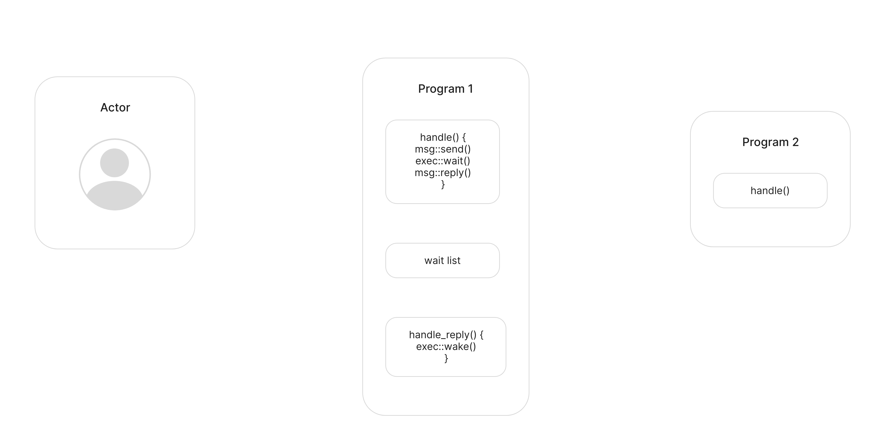
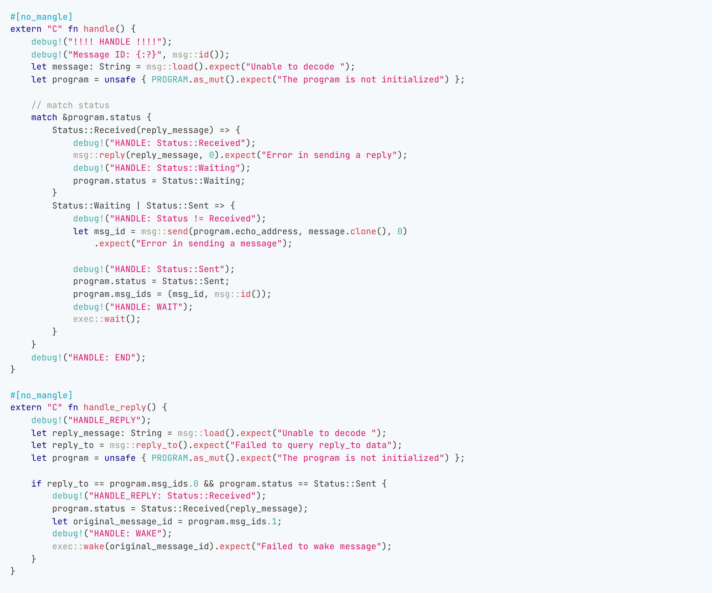

# Handle reply with wait() and wake()

Now let's use the knowledge about `exec::wait()`/`exec::wake()` functions and try to improve the program that was shown in the previous lesson.



As you can see, the user will no longer receive two separate messages; instead, a single reply will be sent at the end of the entire process.

## First program

As the second programme remains unchanged, let's proceed directly to examining the modifications in the first program:

```rust
type MessageSentId = MessageId;
type OriginalMessageId = MessageId;

struct Session {
    second_program: ActorId,
    msg_ids: (MessageSentId, OriginalMessageId),
    message_status: MessageStatus,
}
```
New fields have been created
- `msg_ids` — a tuple consisting of two elements: MessageSentId and OriginalMessageId;
    - `MessageSentId` - identifier of the message to be sent to the second program address;
    - `OriginalMessageId` - identifier of the message to be sent to the first program (required for using the wake() function).
- `message_status` - session status (required to track session activity stages).

```rust
enum MessageStatus {
    Waiting,
    Sent,
    Received(Event),
}
```
- `Waiting` — the session is in a waiting state;
- `Sent` - the intermediate state of the session in which the message was sent to the second program, but the response has not yet been received;
- `Received(String)` - the session state in which the reply message was received.

Considering the new fields in the program structure, initialization appears as follows:

```rust
#[no_mangle]
extern "C" fn init() {
    let second_program = msg::load().expect("Unable to decode Init");
    unsafe {
        SESSION = Some(Session {
            second_program,
            msg_ids: (MessageId::zero(), MessageId::zero()),
            message_status: MessageStatus::Waiting,
        });
    }
}
```

This time, let's incorporate debugging into our program to gain a comprehensive understanding of the entire process.

```rust
#[no_mangle]
extern "C" fn handle() {
    debug!("!!!! HANDLE !!!!");
    debug!("Message ID: {:?}", msg::id());
    let action: Action = msg::load().expect("Unable to decode `Action`");
    debug!("Message payload: {:?}", action);
    let session = unsafe { SESSION.as_mut().expect("The session is not initialized") };

    // match message_status
    match &session.message_status {
        MessageStatus::Waiting => {
            debug!("HANDLE: MessageStatus::Waiting");
            let msg_id = msg::send(session.second_program, action, 0)
                .expect("Error in sending a message");
            debug!("HANDLE: MessageStatus::Sent");
            session.message_status = MessageStatus::Sent;
            session.msg_ids = (msg_id, msg::id());
            debug!("HANDLE: WAIT");
            exec::wait();
        }
        MessageStatus::Sent => {
            debug!("HANDLE: MessageStatus::Sent");
            msg::reply(Event::MessageAlreadySent, 0).expect("Error in sending a reply");
        }
        MessageStatus::Received(reply_message) => {
            debug!("HANDLE: MessageStatus::Received({:?})", reply_message);
            msg::reply(reply_message, 0).expect("Error in sending a reply");
            session.message_status = MessageStatus::Waiting;
        }
    }
    debug!("HANDLE: END");
}
```

At the very beginning, as you may have noticed, the session is in `MessageStatus::Waiting` state. When a match occurs, the code switches to the first option. The program sends a message, sets the session status to `MessageStatus::Sent` and records the identifiers of the current and sent message. Then `exec::wait()` is called, which pauses message processing and adds the current message to the waiting list until `exec::wake(message_id)` is called or the gas runs out. Subsequent waking of a message requires its id, so `msg::id()` is stored in `session.msg_ids`.

Let's move on to the `handle_reply()` function: 

```rust
#[no_mangle]
extern "C" fn handle_reply() {
    debug!("HANDLE_REPLY");
    let reply_to = msg::reply_to().expect("Failed to query reply_to data");
    let session = unsafe { SESSION.as_mut().expect("The session is not initialized") };

    if reply_to == session.msg_ids.0 && session.message_status == MessageStatus::Sent {
        let reply_message: Event = msg::load().expect("Unable to decode `Event`");
        debug!("HANDLE_REPLY: MessageStatus::Received {:?}", reply_message);
        session.message_status = MessageStatus::Received(reply_message);
        let original_message_id = session.msg_ids.1;
        debug!("HANDLE: WAKE");
        exec::wake(original_message_id).expect("Failed to wake message");
    }
}
```

Сondition  `if reply_to == session.msg_ids.0 && session.message_status == MessageStatus::Sent` gives a guarantee that the expected message has arrived and arrived at the right moment, i.e. at the correct session status. 
After that the status is set to `MessageStatus::Received(reply_message)` and the response message is saved. The ID of the original message is retrieved, and the `exec::wake()` function is called. This function retrieves the message from the waiting list, and the suspended message is resumed in the `handle()` function.

*Important note*:  when `exec::wake()` is called, the message is taken from the waiting list, it returns to the `handle()` entrypoint, and message processing will start handling the message from the beginning, i.e. the program code will get into the `match` again:

```rust
// ...
match &session.message_status {
    // ...
    MessageStatus::Received(reply_message) => {
        debug!("HANDLE: MessageStatus::Received({:?})", reply_message);
        msg::reply(reply_message, 0).expect("Error in sending a reply");
        session.message_status = MessageStatus::Waiting;
    }
    // ...
```
However, this time it will go into the third variant, send a response and set the status to `MessageStatus::Waiting`.

Now, let's examine this process as a whole: 



