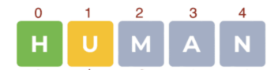
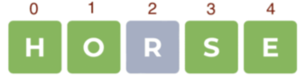
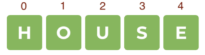

# Assignment

## Task Description

For this assignment, you are tasked with writing the Wordle game.

Wordle is a captivating word-guessing game that has become popular for its simplicity and addictive gameplay. The goal is to guess a hidden word within a limited number of attempts.

The game board consists of six rows, each allowing the player to input a word. Upon entering a word, the player receives feedback indicating the presence of letters in the hidden word and their correct positions. If a letter is present but in the wrong position, it may be highlighted in a different color or marked with a distinct symbol. Players utilize these clues to deduce the correct letters and their placements.

The game challenges players to guess the word with the fewest attempts, under time constraints and limited attempts, adding excitement and suspense.

 ## Project Structure

Break down your Wordle game into two programs for a more engaging and flexible experience. The Wordle program will handle the core functionalities, such as selecting a random word from a list and evaluating guesses. The Game Session program will manage user interactions, keep track of the game state, and enforce time constraints. This division aims to create a modular, flexible system that enhances the gaming experience.

1. **Description of the Wordle program**:
    - Contains "start the game" and "check the word" functions.
    - A word bank exists within the program for selecting a random word at the game's start.
    - "Start the game" function initiates the game and selects a random word.
    - "Check the word" function assesses the player's guess against the hidden word, providing feedback on correct letter positions.

2. **Description of the Game Session program**:
    - Manages interactions with the Wordle program and oversees the gameplay.
    - Tracks previous responses and the number of attempts.
    - Monitors the elapsed time since the game started to manage time constraints and events.

3. **Interaction Between the Programs**:
    - The user initiates the game by sending a message to the Game Session program.
    - The Game Session program invokes the Wordle program's "start the game" function.
    - The user submits their guesses to the Game Session program, which forwards them to the Wordle program's "check the word" function.
    - The Wordle program returns feedback on the guess's accuracy and letter positions.
    - The Game Session program analyzes the result, tracking attempts and time.

4. **Key Implementation Aspects**:
    - The Game Session program requires mechanisms to store data about previous moves and track time.
    - Efficient interaction with the Wordle program through data exchange and response handling is crucial.

## Wordle program

The Wordle program is already implemented. Its functionality includes:

Metadata contains:

```rust
pub struct WordleMetadata;

impl Metadata for WordleMetadata {
    type Init = ();
    type Handle = InOut<Action, Event>;
    type Others = ();
    type Reply = ();
    type Signal = ();
    type State = ();
}
```

Functions:

- `StartGame` - starts the game, selects a random word and returns the reply as `GameStarted{user: ActorId}`.
- `CheckWord` - checks the word and returns the reply as `WordChecked { user: ActorId, correct_positions: Vec<u8>,contained_in_word: Vec<u8> }`, where in the `correct_positions` returns the indices of letters that are in their place, and `contained_in_word` returns the indices of letters that are contained in the word but are in the wrong place.

Below is the comprehensive code for the Wordle program: 

```rust
pub enum Action {
    StartGame {
        user: ActorId,
    },
    CheckWord {
        user: ActorId,
        word: String,
    }
}

pub enum Event {
    GameStarted {
        user: ActorId,
    },
    WordChecked {
        user: ActorId,
        correct_positions: Vec<u8>,
        contained_in_word: Vec<u8>,
    },
}
```

```rust
#![no_std]
use gstd::{collections::HashMap, exec, msg, prelude::*, ActorId};
use wordle_io::*;

static mut WORDLE: Option<Wordle> = None;

const BANK_OF_WORDS: [&str; 3] = ["house", "human", "horse"];

#[derive(Default)]
struct Wordle {
    games: HashMap<ActorId, String>,
}

#[no_mangle]
extern "C" fn init() {
    unsafe {
        WORDLE = Some(Wordle {
            games: HashMap::new(),
        });
    }
}

#[no_mangle]
extern "C" fn handle() {
    let action: Action = msg::load().expect("Unable to decode ");
    let wordle = unsafe { WORDLE.as_mut().expect("The program is not initialized") };

    let reply = match action {
        Action::StartGame { user } => {
            let random_id = get_random_value(BANK_OF_WORDS.len() as u8);
            let word = BANK_OF_WORDS[random_id as usize];
            wordle.games.insert(user, word.to_string());
            Event::GameStarted { user }
        }
        Action::CheckWord { user, word } => {
            if word.len() != 5 {
                panic!("The length of the word exceeds 5");
            }
            let key_word = wordle
                .games
                .get(&user)
                .expect("There is no game with this user");
            let mut matched_indices = Vec::with_capacity(5);
            let mut key_indices = Vec::with_capacity(5);
            for (i, (a, b)) in key_word.chars().zip(word.chars()).enumerate() {
                if a == b {
                    matched_indices.push(i as u8);
                } else if key_word.contains(b) {
                    key_indices.push(i as u8);
                }
            }

            Event::WordChecked {
                user,
                correct_positions: matched_indices,
                contained_in_word: key_indices,
            }
        }
    };

    msg::reply(reply, 0).expect("Error in sending a reply");
}

static mut SEED: u8 = 0;

pub fn get_random_value(range: u8) -> u8 {
    let seed = unsafe { SEED };
    unsafe { SEED = SEED.wrapping_add(1) };
    let mut random_input: [u8; 32] = exec::program_id().into();
    random_input[0] = random_input[0].wrapping_add(seed);
    let (random, _) = exec::random(random_input).expect("Error in getting random number");
    random[0] % range
}
```

For instance, consider a scenario where the secret word is *house*. If the user submits the word *human*, the `correct_positions` would be `[0]`, indicating that the letter "h" is in the correct position (at index 0) in the secret word. Also, `contained_in_word` will be `[1]`, indicating that the letter "u" is present in the secret word but not in the correct position.



Now, let's examine another scenario where the user inputs the word *horse*. In this case, `correct_positions` would be `[0, 1, 3, 4]`, indicating that the letters "h", "o", "s", and "e" are in the correct positions (at indices 0, 1, 3, and 4) in the secret word. However, `contained_in_word` would be empty.



Finally, if the user correctly guesses the secret word *house*, `correct_positions` would contain all indices from 0 to 4, indicating that all letters are in the correct positions. This signifies the end of the game.



Through these examples, one can see how the program evaluates user guesses and provides feedback based on the positions of correct letters in the secret word.

## The Assignment

Create a Game Session program that interfaces between the user and the Wordle program.

1. **Initialization Function (`init()`):**
    - Receives and stores the Wordle program's address.

2. **Handle Function (`handle()`):**
    - Manages actions: `StartGame`, `CheckWord`, `CheckGameStatus`.
Let's examine the functionality of each action:

- `StartGame`:
    - The program checks if a game already exists for the user;
    - It sends a "StartGame" message to the Wordle program;
    - Utilizes the `exec::wait()` or `exec::wait_for()` function to await a response;
    - Sends a delayed message with action `CheckGameStatus` to monitor the game's progress (its logic will be described below);
    - A reply is sent to notify the user that the game has beeen successfully started.

- `CheckWord`:
    - Ensures that a game exists and is in the correct status;
    - Validates that the submitted word length is five and is in lowercase;
    - Sends a "CheckWord" message to the Wordle program;
    - Utilizes the `exec::wait()` or `exec::wait_for()` function to await a reply;
    - Sends a reply to notify the user that the move was successful.

- `CheckGameStatus`:
    - The game should have a time limit from its start, so a delayed message is sent to check the game status.
    If the game is not finished within the specified time limit, it ends the game by transitioning it to the desired status.
    Specify a delay equal to 200 blocks (10 minutes) for the delayed message.

3. **Handle Reply Function (`handle_reply()`)**:

Processes reply messages and updates the game status based on responses from the Wordle program.

- Receives reply messages.
- Utilizes `msg::reply_to()` to determine the message identifier, i.e., which message was replied to.
- Processes and stores the result depending on the reply:
  - If a `GameStarted` response is received, it updates the game status to indicate that the game was successfully started. 
  - If a `WordChecked` response is received, it saves the response, increments the number of tries, and checks if the word was guessed.
  - If the word has been guessed, it switches the game status to `GameOver(Win)`. 
  - If all attempts are used up and the word is not guessed, it switches the game status to `GameOver(Lose)`.
- Calls `wake()` with the identifier of the received message to acknowledge the response.

4. **State Function (`state()`)**:
- It is necessary to implement the state() function in order to get all the information about the game.

## Testing

All program actions should be checked in tests using the [`gtest`](https://docs.gear.rs/gtest/) crate.
- Verify all strategies of the game program.
- Test the delayed message logic.
- Address negative scenarios and invalid inputs handling.

## Afterword

- The assignment should be done as the PR in the GitHub repository.
